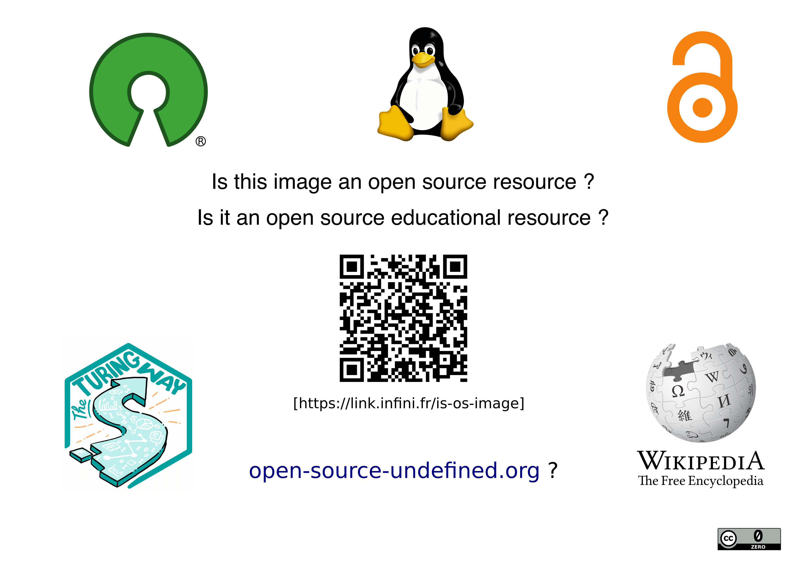

## The Open Source Image ?

{width=80% fig-align="center"}

An image to question the meaning of open source beyond software to explore the idea of open source resources.
Does the availability of sources mean that the image can be qualified as open source?

<a download="image-source.svg" href="./image.svg">
    Download SVG source of the image
</a>

### Edit Image

The SVG file can be imported in any vector graphics editor enabling you to interact with all layers of this image.
For example, [Inkscape](https://inkscape.org/) is an open source software that can be used for this purpose.

### Pedagogical Guideline

The aim is to use this image as a starting point for thinking about the concept of « open source », by letting people
reflect based on this simple image. The idea is to share this image alone to simply ask: is this open
source? A whole discussion can then accompany the person's reflection.

The image can be shared online or even printed. The link and the QR code then bring to this page, to access this
educational content and all these sources.

In addition to the image, the interest is in questioning the notion of « Open Source Educational Resource » by considering
the whole project. An opportunity to promote open education.

### Licence

The open educational resource is licensed under [Creative Commons Zero](https://creativecommons.org/publicdomain/zero/1.0/) to be
freely used, modified and shared. The entire (Markdown) sources for this resource can be found on the « Open Source Undefined »
[repository](https://github.com/Open-Models/Open-Source-Undefined).
